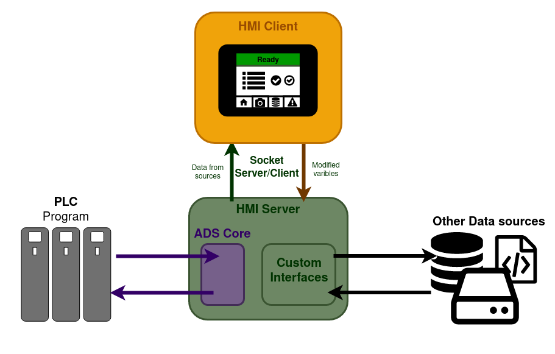

# How it works

The HMI is built on the idea of a client-server model using sockets. Not only does this method help to naturally enforce positive compartmentalisation of code but also can allow for extended functionality like: 

* Multiple clients to be connected to a single server
* Live development of HMIs
* Remote servers to reduce load on the IPC/CX

## The Server

The server manages the reading and writing of data to the different sources that communicate with the HMI.

It complies this information in to JSON and serves it to the client via a socket server which enables live updates between server, client, and PLC.

The main source of information to be displayed and edited is the PLC, the base functionality of this connection has been implemented and included as part of the HMI under the library "ADS Core". To find out more about this library please head to [ADS Core](server/ads_core.md)

## The Client

The client is based on web technologies and is written in CSS, HTML, and JS. It formats the data received from the server in to a user friendly interface which is displayed via a lightweight web browser on the panel.

The main framework used for layout is [Vuetify](https://vuetifyjs.com/en/components/alerts/). This works alongside [Vue.js](https://v2.vuejs.org/) to create a reactive and easy to use layout system.

## Diagram
